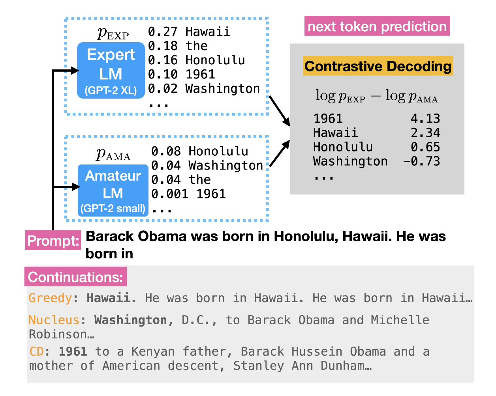
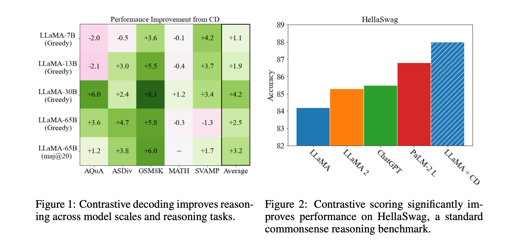
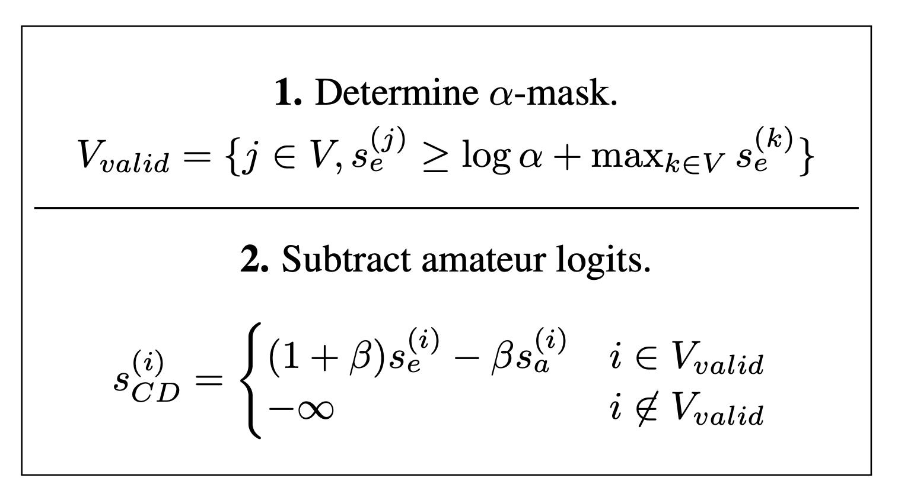
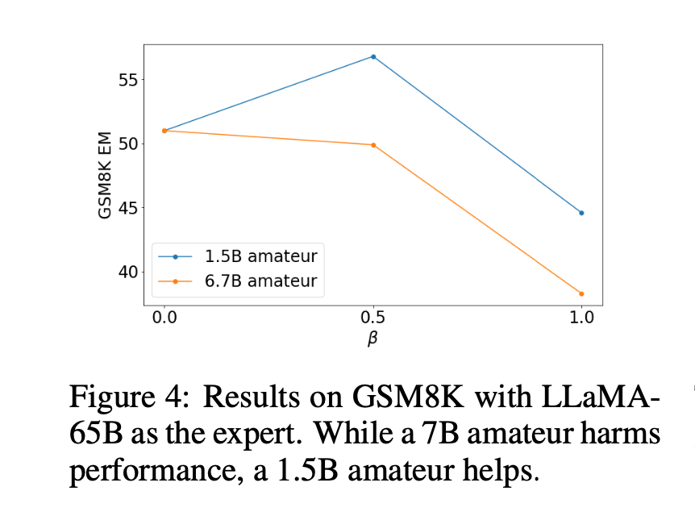
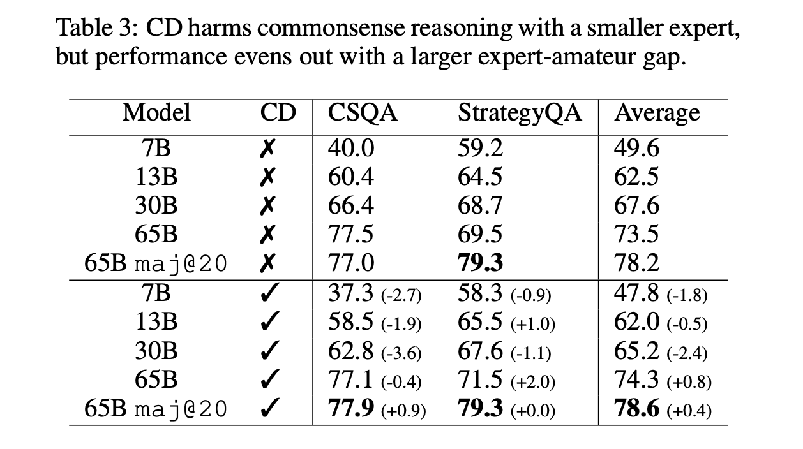

# Paper Presentation: CONTRASTIVE DECODING IMPROVES REASONING IN LARGE LANGUAGE MODELS

### Overview

- **Background**
  
  - **Problems of LLM different decoding ways**
    
    Greedy decoding: provides a precise and accurate calculation.
    
    Truncated sampling: introduces uncertainty and might even lead to inaccuracies.
    
    **1. Open-ended Text Generation Task**:
    
    **Task**: "Describe a scene at a bustling marketplace."
    
    *Using Truncated Sampling*: Output: "The marketplace buzzed with life. Vibrant stalls showcased a kaleidoscope of colors: ripe fruits, hand-woven fabrics, and shimmering trinkets. Laughter echoed, as kids chased one another, weaving through a maze of shoppers haggling over prices."
    
    *Using Greedy Decoding*: Output: "The marketplace was busy. There were many people. There were stalls with fruits and clothes. It was loud."
    
    **2. Reasoning Problem**:
    
    **Task**: "John bought 4 shirts for 20 each and 3 hats for 15 each. How much did he spend in total?"
    
    *Using Truncated Sampling*: Output: "John shopped energetically, picking colorful shirts and stylish hats. After making his selections, he realized he spent a mixture of amounts, possibly around 110 or maybe 125?"
    
    *Using Greedy Decoding*: Output: "John spent 80 on shirts and 45 on hats. He spent $125 in total."
    
  - **Contrasive Decoding**
    
  
  
  
  
- **Approach**
  
  
  
  - **Algebraic word problems**
    
  - **commonsense reasoning**
    

### Question #1: What is the basic idea of Contrastive Decoding?

### Architecture overview

- **Determine α-mask**
  
  Tokens with probabilities below a threshold set by this hyperparameter are masked out. α controls the cut-off threshold for masking out low probability tokens, relative to the maximum probability token. A higher α leads to more aggressive masking, while lower α preserves more candidate tokens.
  
  Tuning α allows us to remove unlikely candidates before applying the contrastive decoding objective. This helps focus the search on plausible tokens only.
  
- **Subtract amateur logits**
  
  The key motivation is that we want to penalize and downgrade tokens that the amateur model assigns high probability to. The amateur model represents
  low-quality behaviors we want to avoid repeating.
  
  - Penalize tokens preferred by amateur model
    
  - Amplify the preference of expert for good tokens
    
- **Algorithm: Contrastive Decoding(expert_logits, amateur_logits, alpha, beta)**
  
  
  
  - Input:
    
    *expert_logits*: Unnormalized scores from the expert model
    
    *amateur_logits*: Unnormalized scores from the amateur model
    
  - Output:
    
    *cd_logits*: Updated representation based on expert and amateur differences
    
  - Hyperparameters:
    
    *α*: Masking ratio
    
    *β*: Contrastive strength
    
    *Size of the amateur model*
    
  
  1. *cutoff <— log(α) + Max(expert_logits,dim=−1)*
    
  2. *diffs <— (1+β)×expert_logits - β×amateur_logits*
    
  3. *For each value in expert_probs < cutoff:*
    
    *Set corresponding value in diffs to -∞*
    
  4. *cd_logits <— diffs*
    
    Return *cd_logits*
    

### Question #2: How should we choose the amateur model?

### Experiments

- **Arithmetic reasoning**

We conjecture that because contrastive decoding amplifies skills that the expert has learned better than the amateur, it cannot help on tasks that are well beyond the expert’s ability.

- **Commonsense reasoning**

Results are more mixed for CommonsenseQA and StrategyQA

- **Contrastive ranking**

Notably, on HellaSwag CD leads LLaMA-65B to score 88.0, which outperforms LLaMA-2
(85.3), GPT-3.5 (85.5)and PALM 2-Large (86.8).

### Results

On GSM8K, contrastive decoding improves the performance of various LLaMA models by up to 8 absolute percentage points. This result outperforms LLaMA 2, which has 5 billion more parameters and is trained on 40% more data.

On HellaSwag, using the CD objective to rank answers and involve choosing the most logical continuation of a sentence leads LLaMA to outperform all existing models except GPT-4. We find general improvement on arithmetic reasoning and multiple-choice ranking tasks, including on models as large as LLaMA-65B, suggesting that Contrastive Decoding could bring such widespread improvements to much larger models.

Contrastive Decoding performs less surface-level copying from the prompt than greedy decoding and misses fewer reasoning steps. Contrastive Decoding works by reducing repetitive or other undesirable modes of the model distribution.

### Critical analysis

- Test on more commonsense reasoning datasets to determine generalization
  
- Explore more amateur model designs for insights into contrastive mechanism
  
- Verify generality by testing other model families
  
- Deeper analysis into reasoning improvements to reveal strengths/weaknesses
  
- Consider potential long-term risks like exploiting amateur blindspots
  

### Code demonstration

[Google Colab](https://colab.research.google.com/drive/12-5niY-kKRD9_0xxTfDs3NuoqwIe3avx) Simulation of the paper example by using Contrastive Decoding

[Google Colab](https://colab.research.google.com/drive/1aa-cbCRZVqOe94Aa1C3tPK7qiqowSHhz#scrollTo=8Foucs9EY6aM) Implemention on LLM

### Resource links

[GitHub - XiangLi1999/ContrastiveDecoding: contrastive decoding](https://github.com/XiangLi1999/ContrastiveDecoding)

[[2210.15097] Contrastive Decoding: Open-ended Text Generation as Optimization](https://arxiv.org/abs/2210.15097)

[[2201.11903] Chain-of-Thought Prompting Elicits Reasoning in Large Language Models](https://arxiv.org/abs/2201.11903)

[[2105.03023] DExperts: Decoding-Time Controlled Text Generation with Experts and Anti-Experts](https://arxiv.org/abs/2105.03023)

[[2305.07378] Surfacing Biases in Large Language Models using Contrastive Input Decoding](https://arxiv.org/abs/2305.07378)

[Enhancing Neural Network Reasoning: The Promise of Contrastive Decoding for LLMs | HackerNoon](https://hackernoon.com/enhancing-neural-network-reasoning-the-promise-of-contrastive-decoding-for-llms)

### Citation

Xiang Lisa Li, Ari Holtzman, Daniel Fried, Percy Liang, Jason Eisner, Tatsunori Hashimoto, Luke Zettlemoyer, and Mike Lewis. Contrastive decoding: Open-ended text generation as optimization, 2022.

Alisa Liu, Maarten Sap, Ximing Lu, Swabha Swayamdipta, Chandra Bhagavatula, Noah A. Smith, and Yejin Choi. Dexperts: Decoding-time controlled text generation with experts and anti-experts, 2021.

Karl Cobbe, Vineet Kosaraju, Mohammad Bavarian, Mark Chen, Heewoo Jun, Lukasz Kaiser, Matthias Plappert, Jerry Tworek, Jacob Hilton, Reiichiro Nakano, Christopher Hesse, and John Schulman. Training verifiers to solve math word problems, 2021.

### Video

[YouTube](https://youtu.be/1pJr0FMWwbk)
